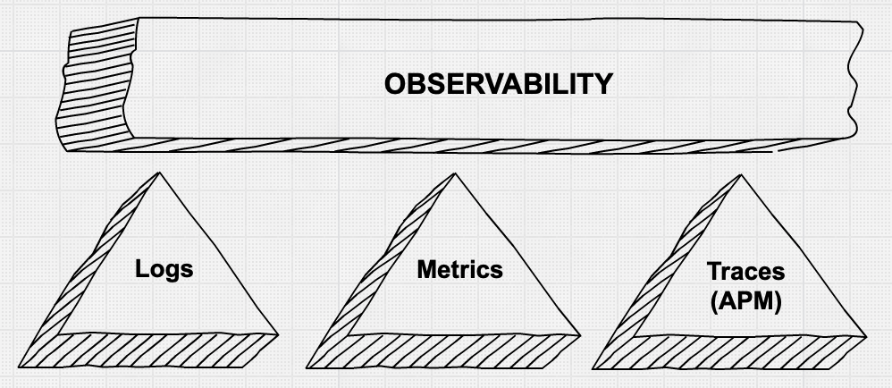
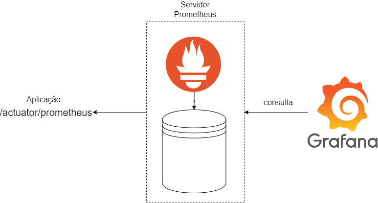

# Monitoramento de métricas com Spring Actuator, Prometheus e Grafana


## Objetivo
O objetivo deste projeto é demonstrar a facilidade de monitorar uma aplicação Spring Boot com o Spring Actuator, Prometheus e Grafana.

## Introdução
A observabilidade está apoiada em três pilares: logs, métricas e rastreamento .
Neste projeto, no entanto, vamos nos ater somente ao pilar de métricas. 
Em especial, o foco será em como monitorar o tempo de serviço de uma aplicação Spring Boot.
Para isso, iremos criar a arquitetura a seguir.

## Arquitetura



## Tecnologias utilizadas
1. Spring Actuator para monitoramento de métricas
2. Prometheus para coleta e armazenamento de métricas
3. Grafana para visualização de métricas
4. Docker para facilitar o setup das dependências


## Configurando a aplicação Spring Boot


### 1) Adicionando as dependências do Spring Actuator e do Prometheus
Para coletar e exportar métricas de uma aplicação Spring Boot, é necessário adicionar as dependências do Spring Actuator e do Prometheus no arquivo pom.xml:

```xml
<dependency>
    <groupId>org.springframework.boot</groupId>
    <artifactId>spring-boot-starter-actuator</artifactId>
</dependency>

<dependency>
    <groupId>io.micrometer</groupId>
    <artifactId>micrometer-registry-prometheus</artifactId>
    <scope>runtime</scope>
</dependency>
```


### 2) Configurando o Actuator para expor as métricas


#### 2.1) Expondo os endpoints do Actuator

Por padrão e por questões de segurança, o Spring Actuator expõe somente as métricas de saúde da aplicação. 
Para expor outras métricas, é necessário configurar o Actuator.
Para isso, basta adicionar os endpoints de interesse no arquivo application.properties:

```properties
# Actuator properties
# Habilita os endpoints de métricas e o endpoint que exporta as métricas no formato prometheus
management.endpoints.web.exposure.include=health,metrics,prometheus
```
Para uma lista completa de endpoints disponíveis, acesse a [documentação oficial](https://docs.spring.io/spring-boot/docs/2.2.x/reference/html/production-ready-features.html#production-ready-endpoints).


#### 2.2) Registrando os beans necessários

O próximo passo é expor os seguintes beans com a finalidade de configurar o Micrometer
```java
@Bean
public MeterRegistry meterRegistry() {
    CompositeMeterRegistry registry = new CompositeMeterRegistry();
    return registry;
}

@Bean
public TimedAspect timedAspect(MeterRegistry registry) {
    return new TimedAspect(registry);
}
```

### 2) Exemplo de monitoramento do tempo de serviço de um endpoint
```java
@RestController
public class HelloController {
    
    @Timed(value = "hello.time", description = "Tempo de resposta do método hello")
    @GetMapping("/hello")
    public String hello() {
        return "Hello World!";
    }
}
```
A anotação @Timed é a responsável por monitorar o tempo de serviço de um método.

Com isso, as métricas serão expostas no endpoint http://localhost:8080/actuator/prometheus.
Resta agora, configurar o Prometheus para ler essa métricas e armazená-las em seu banco de dados.

## Configurando o Prometheus e o Grafana

### 1) Baixando o Prometheus e o Grafana

Primeiramente, é necessário baixar o Prometheus e o Grafana. Para isso, vamos utilizar o Docker. 
Abaixo há um exemplo de como baixar o Prometheus e o Grafana utilizando o Docker Compose:

```yaml
prometheus:
    container_name: "prometheus"
    image: prom/prometheus:latest
    ports:
      - "9090:9090"
    volumes:
      - "./prometheus.yml:/etc/prometheus/prometheus.yml:ro"

grafana:
    container_name: "grafana"
    image: grafana/grafana:latest
    ports:
      - "3000:3000"
    volumes:
      - "./docker/data/grafana:/var/lib/grafana"
```

### 2) Configurando o Prometheus
O prometheus busca por um arquivo de configuração chamado *prometheus.yml*.
Abaixo encontra-se um exemplo de configuração básica do Prometheus para coletar as métricas do nosso projeto:

```yaml
global:
  scrape_interval: 5s

scrape_configs:
  - job_name: "example-service"
    metrics_path: "/actuator/prometheus"
    static_configs:
      - targets: [ "host.docker.internal:8080" ]
```

Para maiores informações, acesse a [documentação oficial](https://prometheus.io/docs/prometheus/latest/configuration/configuration/).

### 3) Configurando o Grafana
O Grafana é uma ferramenta de visualização de métricas. Para configurar o Grafana, é necessário criar um *datasource* e um *dashboard*.
Para isso, basta acessar o [endereço padrão do grafana](http://localhost:3030) e configurar o Prometheus como datasource, conforme descrito na [documentação oficial](https://grafana.com/docs/grafana/latest/datasources/prometheus/).


# Conceitos importantes

## Tempo de serviço vs Tempo de resposta
O tempo de serviço é o tempo que o método leva para executar uma tarefa.
Enquanto que o tempo de resposta é o tempo que o cliente leva para receber a resposta do servidor.

## Por que medir os percentis ao invés da média?
A média é uma medida de tendência central que representa o valor central de um conjunto de dados.
Porém, a média não é uma boa medida para representar o tempo de resposta de uma aplicação, pois ela é muito sensível a outliers.
Por exemplo, se um método leva 1 segundo para responder em 99% das vezes e 10 segundos em 1% das vezes, a média será de 1,9 segundos.
Porém, a maioria dos clientes receberá a resposta em 1 segundo, mas 1% dos clientes terão que esperar 10 segundos para receber a resposta.
Neste caso, a média não representa bem o tempo de resposta da aplicação.
